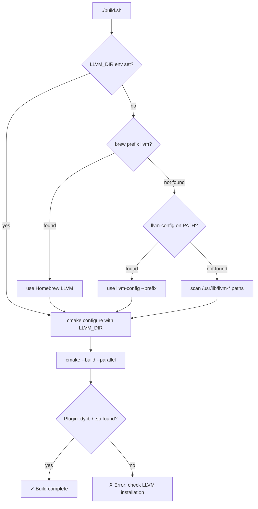
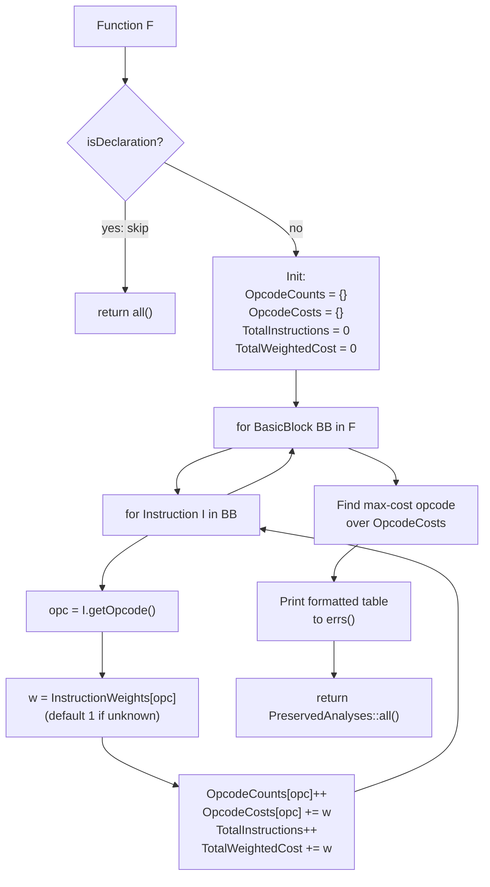
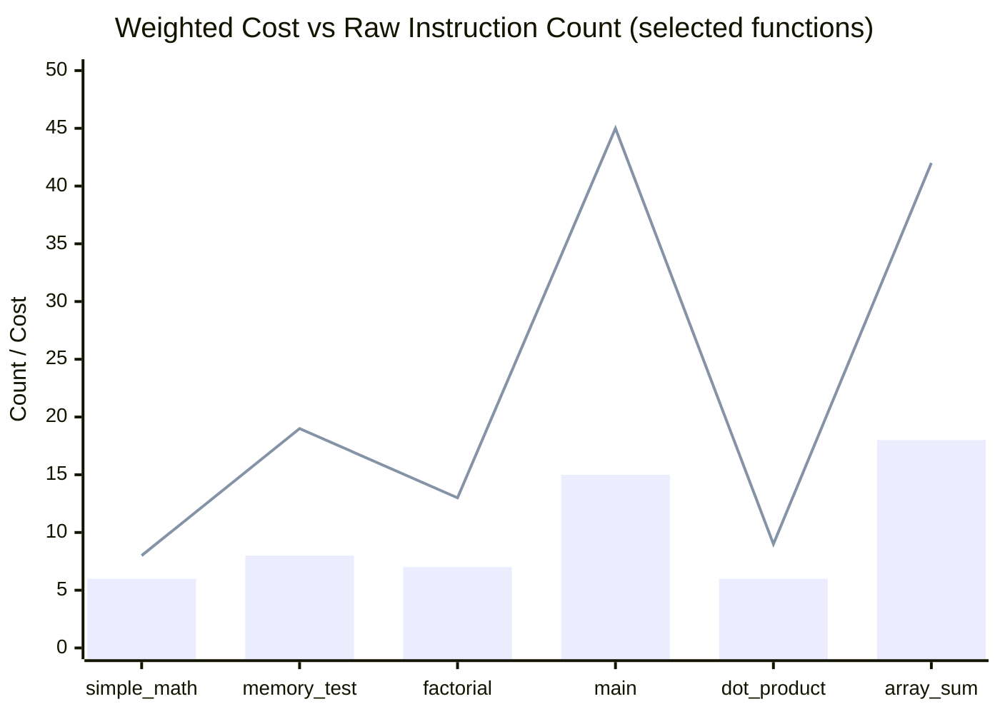

# WeightedInstrFreq — Weighted Instruction Frequency Analysis Pass

> **Assignment 17** — Compiler Design  
> An LLVM FunctionPass that counts instructions, assigns weighted costs, and reports the most expensive instruction type per function.

---

## Table of Contents

1. [What This Pass Does](#1-what-this-pass-does)
2. [Quick Start](#2-quick-start)
3. [Repository Layout](#3-repository-layout)
4. [Prerequisites](#4-prerequisites)
5. [Building](#5-building)
6. [Running the Pass](#6-running-the-pass)
7. [Architecture Overview](#7-architecture-overview)
8. [Pass Data Flow](#8-pass-data-flow)
9. [Instruction Weight Table](#9-instruction-weight-table)
10. [Output Format](#10-output-format)
11. [Test Cases](#11-test-cases)
12. [Evaluation Summary](#12-evaluation-summary)
13. [How Weights Affect Interpretation](#13-how-weights-affect-interpretation)
14. [Documentation](#14-documentation)
15. [Troubleshooting](#15-troubleshooting)

---

## 1. What This Pass Does

**WeightedInstrFreq** is an LLVM FunctionPass that goes beyond raw instruction counting. For every function in an LLVM IR module it:

1. **Iterates** over every `BasicBlock` and every `Instruction`.
2. **Counts** how many times each instruction opcode appears.
3. **Assigns a weight** to each opcode based on its estimated hardware cost.
4. **Computes** the total weighted cost for the function.
5. **Prints** a structured report to `stderr`:
   - Per-opcode instruction frequency and weighted cost
   - Total weighted cost for the function
   - The most expensive instruction type (by accumulated weighted cost)

This gives a richer view of computational cost than raw counts alone — a single `call` instruction (weight 5) is identified as more expensive than five `add` instructions (weight 1 each).

---

## 2. Quick Start

```bash
# 1. Clone / enter the repo
cd WeightedInstrFreq

# 2. Build the plugin
./build.sh

# 3. Run on a test file
./run.sh tests/test1.ll

# 4. Run on all test files
./run.sh --all

# 5. Run all tests and save outputs to output/
./run.sh --all --save
```

---

## 3. Repository Layout

```text
WeightedInstrFreq/
├── build.sh                          # ← Entry point: configure + build
├── run.sh                            # ← Entry point: run the pass
├── CMakeLists.txt                    # CMake build definition
│
├── src/
│   ├── WeightedInstrFreq.cpp         # Pass implementation + plugin registration
│   ├── WeightedInstrFreq.h           # Pass struct declaration
│   └── PassPlugin.cpp                # Standalone plugin example (not in default build)
│
├── tests/                            # LLVM IR test inputs (≥5 .ll files)
│   ├── test1.ll   — simple arithmetic
│   ├── test2.ll   — memory operations & function calls
│   ├── test3.ll   — control flow, branches, recursion
│   ├── test4.c    — C source for test4
│   ├── test4.ll   — compiled C with load/store/call mix
│   ├── test5.ll   — floating-point intensive
│   ├── test6.ll   — bitwise ops & type conversions
│   └── test7.ll   — mixed high-cost: memory + calls + division
│
├── output/                           # Reference outputs from opt
│   ├── test1_output.txt
│   ├── test2_output.txt
│   ├── test3_output.txt
│   └── test4_output.txt
│
├── documentation/
│   ├── DESIGN.md          # Approach, alternatives, design decisions
│   ├── IMPLEMENTATION.md  # LLVM APIs, build system, IR traversal details
│   └── EVALUATION.md      # Metrics, per-test tables, baseline comparison
│
└── build/                            # CMake build artifacts (git-ignored)
    └── WeightedInstrFreqPass.dylib   # (or .so on Linux)
```

---

## 4. Prerequisites

| Requirement | Version | Purpose |
|-------------|---------|---------|
| **CMake** | ≥ 3.20 | Build system |
| **LLVM / Clang** | ≥ 14 (tested: 22.x) | Compiler + `opt` + plugin API |
| **C++17 compiler** | e.g. clang++ from LLVM | Build the plugin |

### macOS (Homebrew)

```bash
brew install llvm
export PATH="$(brew --prefix llvm)/bin:$PATH"
```

### Ubuntu / Debian

```bash
sudo apt update
sudo apt install -y llvm-dev clang cmake
```

---

## 5. Building

```bash
./build.sh
```

`build.sh` auto-detects LLVM in this order:



You can also override manually:

```bash
LLVM_DIR=/path/to/llvm/lib/cmake/llvm ./build.sh
```

The output plugin is at `build/WeightedInstrFreqPass.dylib` (macOS) or `build/WeightedInstrFreqPass.so` (Linux).

---

## 6. Running the Pass

### Via `run.sh` (recommended)

```bash
./run.sh tests/test1.ll           # single file
./run.sh --all                    # all .ll files in tests/
./run.sh --all --save             # run all + save to output/
./run.sh tests/test5.ll --save    # single file + save
./run.sh --help                   # show usage
```

### Directly with `opt`

```bash
opt -load-pass-plugin ./build/WeightedInstrFreqPass.dylib \
    -passes='function(weighted-instr-freq)' \
    -disable-output \
    tests/test1.ll
```

The pass writes to `stderr`. Capture it:

```bash
opt -load-pass-plugin ./build/WeightedInstrFreqPass.dylib \
    -passes='function(weighted-instr-freq)' \
    -disable-output \
    tests/test1.ll 2> my_report.txt
```

### Compile C → IR → run pass

```bash
clang -O0 -emit-llvm -S -o /tmp/prog.ll tests/test4.c
opt -load-pass-plugin ./build/WeightedInstrFreqPass.dylib \
    -passes='function(weighted-instr-freq)' \
    -disable-output /tmp/prog.ll
```

### Via optimisation pipeline (O2 / O3)

```bash
opt -load-pass-plugin ./build/WeightedInstrFreqPass.dylib \
    -O2 -disable-output tests/test4.ll
```

The plugin registers an `OptimizerLastEP` callback so it runs automatically at `-O2` and `-O3`.

---

## 7. Architecture Overview

```mermaid
flowchart LR
    IR["LLVM IR\n(.ll file)"] -->|opt --load-pass-plugin| PB["PassBuilder"]
    PB -->|registerPipelineParsingCallback| FPM["FunctionPassManager"]
    PB -->|registerOptimizerLastEPCallback\nO2 / O3| FPM
    FPM --> PASS["WeightedInstrFreqPass\n::run(Function &F)"]
    PASS --> BB["Iterate BasicBlocks"]
    BB --> INSTR["Iterate Instructions"]
    INSTR --> WT["getInstructionWeight(opcode)"]
    WT --> ACC["Accumulate\nOpcodeCounts / OpcodeCosts"]
    ACC --> RPT["Print report\nto stderr"]
```



---

## 8. Pass Data Flow



---

## 9. Instruction Weight Table

| Category | Opcodes | Weight |
|----------|---------|--------|
| Simple arithmetic | `add`, `sub`, `fadd`, `fsub` | 1 |
| Comparisons | `icmp`, `fcmp` | 1 |
| Bitwise / Shift | `and`, `or`, `xor`, `shl`, `lshr`, `ashr` | 1 |
| Integer casts | `trunc`, `zext`, `sext`, `ptrtoint`, `inttoptr`, `bitcast`, `addrspacecast` | 1 |
| Control flow (simple) | `ret`, `phi`, `select` | 1 |
| GEP | `getelementptr` | 1 |
| Multiply | `mul`, `fmul` | 2 |
| FP casts | `fptoui`, `fptosi`, `uitofp`, `sitofp`, `fptrunc`, `fpext` | 2 |
| Stack alloc | `alloca` | 2 |
| Vector ops | `extractelement`, `insertelement`, `insertvalue`, `vaarg` | 2 |
| Control flow (complex) | `br` | 2 |
| Memory | `load`, `store` | 3 |
| Switch / indirect | `switch`, `indirectbr` | 3 |
| Vector shuffle | `shufflevector` | 3 |
| Division / Remainder | `udiv`, `sdiv`, `fdiv`, `urem`, `srem` | 4 |
| Function calls | `call`, `invoke` | 5 |
| Exception handling | `landingpad`, `catchpad`, `cleanuppad` | 5 |
| Atomics | `atomicrmw`, `cmpxchg` | 10 |
| Unknown | (any other opcode) | 1 *(default)* |

---

## 10. Output Format

For each non-declaration function, the pass prints a block to `stderr`:

```
=================================================
  Weighted Instruction Frequency Analysis
=================================================
Function: simple_math
Total Instructions: 6

Instruction Frequency:
  ---------------------------------------------
  Instruction               Count       Cost
  ---------------------------------------------
  ret                           1          1
  add                           2          2
  sub                           1          1
  mul                           2          4
  ---------------------------------------------

Total Weighted Cost: 8

Most Expensive Instruction Type: mul (cost: 4)
=================================================
```

---

## 11. Test Cases

| File | Functions | Key Instruction Mix | Purpose |
|------|-----------|---------------------|---------|
| `tests/test1.ll` | `simple_math`, `just_add` | `add`, `mul`, `sub`, `ret` | Pure arithmetic baseline |
| `tests/test2.ll` | `memory_test`, `store_heavy` | `load`, `store`, `alloca`, `call`, `gep` | Memory operation cost |
| `tests/test3.ll` | `factorial`, `max_of_three` | `br`, `icmp`, `call`, `phi` | Control flow + recursion |
| `tests/test4.c` / `.ll` | `compute`, `swap`, `main` | `load`, `store`, `call`, `alloca`, `sdiv` | Real compiled C program |
| `tests/test5.ll` | `dot_product`, `normalize_score`, `float_to_int_round` | `fmul`, `fadd`, `fsub`, `fdiv`, `fptosi` | Floating-point intensity |
| `tests/test6.ll` | `bitwise_ops`, `type_conversions`, `compare_all` | `and`, `or`, `xor`, `shl`, `zext`, `sext` | Bitwise / cast (cheap) functions |
| `tests/test7.ll` | `array_sum_normalized`, `integer_divide_series` | `load`, `store`, `call`, `phi`, `sdiv`, `urem` | Mixed: memory + calls + division |

---

## 12. Evaluation Summary



> **Blue bars** = raw instruction count · **Orange line** = weighted cost

### Key observations

1. **`call`-heavy functions** (e.g., `main`, `factorial`) show the largest ratio of weighted cost to raw count because each `call` multiplies by 5.
2. **Memory-heavy functions** (`memory_test`, `swap`) are correctly identified as expensive due to `load`/`store` weight = 3.
3. **Bitwise-only functions** (`bitwise_ops`) show weighted cost ≈ raw count, confirming low-cost identification.
4. **Division-heavy functions** (`integer_divide_series`) have weighted cost > 3× their raw count due to weight = 4 per division/remainder.

---

## 13. How Weights Affect Interpretation

The key insight is that **identical raw counts can hide very different real costs**:

| Scenario | Raw says | Weighted says | Why it matters |
|----------|----------|---------------|----------------|
| 5 `add` vs 1 `call` | `add` dominates (5:1 count) | `call` ties or wins (5:5 cost) | Optimise away that call |
| 2 `load` vs 6 `add` | `add` dominates (6:2 count) | `load` wins (6:6 cost) | Cache locality matters |
| 1 `atomicrmw` in a function | Tiny fraction of instructions | Weight-10 bottleneck | Atomic ops are high-overhead |
| Pure bitwise function | Looks like many instructions | Low weighted cost — fast function | Don't over-optimise cheap code |

**Guidance for optimisation:**
- Functions where `call`, `load`/`store`, or `div` dominate the weighted cost are the best targets for code improvements.
- Functions where `add`, `icmp`, or bitwise ops dominate are already cheap — focus elsewhere.

---

## 14. Documentation

Full phase-wise documentation is in the `documentation/` folder:

| Document | Content |
|----------|---------|
| [documentation/DESIGN.md](documentation/DESIGN.md) | Design goals, weight table rationale, alternatives considered |
| [documentation/IMPLEMENTATION.md](documentation/IMPLEMENTATION.md) | LLVM API surface, build system, IR traversal details, plugin registration |
| [documentation/EVALUATION.md](documentation/EVALUATION.md) | Per-test tables, baseline comparison, sensitivity analysis, reproduction steps |

---

## 15. Troubleshooting

| Symptom | Fix |
|---------|-----|
| Plugin fails to load | Ensure built `.dylib`/`.so` matches your `opt` LLVM version. Run `llvm-config --version` and compare. |
| CMake cannot find LLVM | Set `LLVM_DIR` to your `LLVMConfig.cmake` directory. |
| `opt` not found | Add LLVM bin to PATH: `export PATH="$(brew --prefix llvm)/bin:$PATH"` |
| Output is empty | The input IR may contain only declarations. Pass `isDeclaration()` check skips those. |
| macOS linker errors | The CMakeLists.txt forces `-stdlib=libc++` and uses LLVM's own Clang — re-run `./build.sh` cleanly after `rm -rf build/`. |

---

## Tech Stack

| Component | Technology |
|-----------|------------|
| Pass type | LLVM new pass manager `PassInfoMixin<FunctionPass>` |
| Language | C++17 |
| Build | CMake 3.20+, LLVM CMake package |
| Output | Text report to `stderr` via `llvm::errs()` |
| Plugin API | `llvmGetPassPluginInfo` / `LLVM_ATTRIBUTE_WEAK` |
| Test IR | Hand-crafted `.ll` files + `clang -emit-llvm` |
| Platform | macOS (Homebrew LLVM) · Linux (apt LLVM) |

---

## License / Course Context

**Compiler Design** course project — **Assignment 17: Weighted Instruction Frequency Analysis Pass**.
