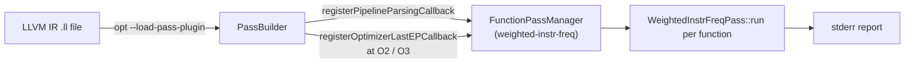
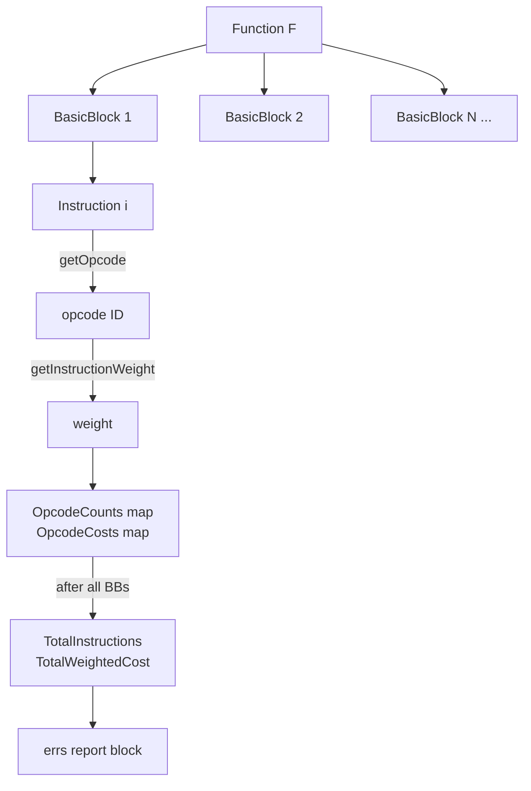

# DESIGN — Weighted Instruction Frequency Analysis Pass

## 1. Overview

The Weighted Instruction Frequency Analysis Pass is an LLVM **FunctionPass** built on the new pass manager (`PassInfoMixin`). Its goal is to give a richer picture of a function's computational cost than a simple instruction count by assigning a numeric **weight** to each instruction opcode and summing those weights across the function.

---

## 2. Motivation

Not all instructions execute in the same number of CPU cycles. A raw instruction count treats `add` and `call` identically, which misrepresents true cost. Weighted analysis lets you:

* Identify the most expensive instruction categories in hot functions.
* Guide optimisation priorities (e.g., reduce calls or memory traffic first).
* Produce a meaningful scalar "cost" that can be compared across functions and over compiler-optimisation levels.

---

## 3. Design Goals

| # | Goal | Priority |
|---|------|----------|
| G1 | Traverse every basic block and instruction in a function | Must |
| G2 | Count occurrences of each opcode | Must |
| G3 | Multiply each count by a configurable weight | Must |
| G4 | Report total weighted cost, per-opcode breakdown, and most-expensive type | Must |
| G5 | Integrate with the LLVM new pass manager as a loadable plugin | Must |
| G6 | Run as both an explicit pass (`-passes='function(weighted-instr-freq)'`) and an optimiser-last extension point | Should |
| G7 | Support macOS (Homebrew LLVM) and Linux (apt LLVM) out of the box | Should |

---

## 4. Weight Table Design

Weights are assigned based on well-known micro-architecture cost heuristics:

| Category | Instructions | Weight | Rationale |
|----------|-------------|--------|-----------|
| Simple arithmetic | `add`, `sub`, `fadd`, `fsub`, `icmp`, `fcmp`, bitwise, shifts, casts | 1–2 | Single ALU cycle |
| Multiply | `mul`, `fmul` | 2 | Typically 3–5 cycles on modern CPUs |
| Memory | `load`, `store` | 3 | L1-hit ~4 cycles; cache misses much worse |
| Alloca | `alloca` | 2 | Stack pointer adjustment; no heap overhead |
| Control flow | `br`, `switch`, `indirectbr` | 2–3 | Branch predictor overhead |
| Division | `udiv`, `sdiv`, `fdiv`, `urem`, `srem` | 4 | 20–90 cycles on x86 |
| Call / Invoke | `call`, `invoke` | 5 | Frame setup + branch prediction miss |
| Exception pads | `landingpad`, `catchpad`, `cleanuppad` | 5 | Rare but complex |
| Atomics | `atomicrmw`, `cmpxchg` | 10 | Cache-line lock; cross-core flush |
| Unknown | anything else | 1 | Conservative fallback |

The weight table is a `std::map<unsigned, unsigned>` keyed by LLVM opcode ID, making it easy to update or serialise.

---

## 5. Pass Pipeline Integration



---

## 6. Data Flow Inside a Function



---

## 7. Output Format

Each function produces a fixed-structure report block printed to `stderr`:

```
=================================================
  Weighted Instruction Frequency Analysis
=================================================
Function: <name>
Total Instructions: <N>

Instruction Frequency:
  ---------------------------------------------
  Instruction               Count       Cost
  ---------------------------------------------
  add                           4          4
  mul                           2          4
  load                          3          9
  call                          1          5
  ret                           1          1
  ---------------------------------------------

Total Weighted Cost: 23

Most Expensive Instruction Type: load (cost: 9)
=================================================
```

---

## 8. Alternatives Considered

### 8.1 ModulePass instead of FunctionPass

| Aspect | FunctionPass ✓ | ModulePass |
|--------|---------------|------------|
| Granularity | Per-function cost | Whole-module aggregate |
| Incremental | Yes | No |
| Complexity | Low | Medium |
| Goal fit | **Better** — per-function cost is the deliverable | Redundant nesting |

**Decision:** FunctionPass via `PassInfoMixin` — the assignment explicitly requires per-function output.

### 8.2 Legacy pass manager vs. new pass manager

| Aspect | New PM ✓ | Legacy PM |
|--------|----------|-----------|
| LLVM support | Active (LLVM 12+) | Deprecated |
| Plugin API | `llvmGetPassPluginInfo` | `RegisterPass<>` |
| Pipeline | Composable | Ad hoc |

**Decision:** New pass manager. LLVM 14+ deprecated the legacy manager for IR passes.

### 8.3 Static vs. configurable weights

Static weights compiled into the binary are simple and deterministic. An alternative is to read weights from a YAML/JSON config at plugin load time. This was considered but deferred — it adds a parsing dependency and complicates the build without changing the algorithmic core.

### 8.4 `errs()` vs. a structured output format

`errs()` (LLVM's thread-safe `raw_ostream` to `stderr`) is the idiomatic LLVM way to produce diagnostic output. An alternative is to write JSON to a file. This was not chosen because the assignment calls for a "print" pass and structured output adds complexity without academic benefit.

---

## 9. Limitations and Future Work

* **Profile-guided weights:** actual per-function execution frequencies (branch probabilities) are not yet used. Combining dynamic frequency with static weights would improve accuracy.
* **Loop-aware costing:** instructions inside loops could be multiplied by expected trip count (from scalar-evolution). Not implemented.
* **YAML weight overrides:** allowing users to provide a custom weight table via a flags or file would make the pass more general.
* **JSON output mode:** emit structured JSON in addition to the text report, useful for tooling integration.
