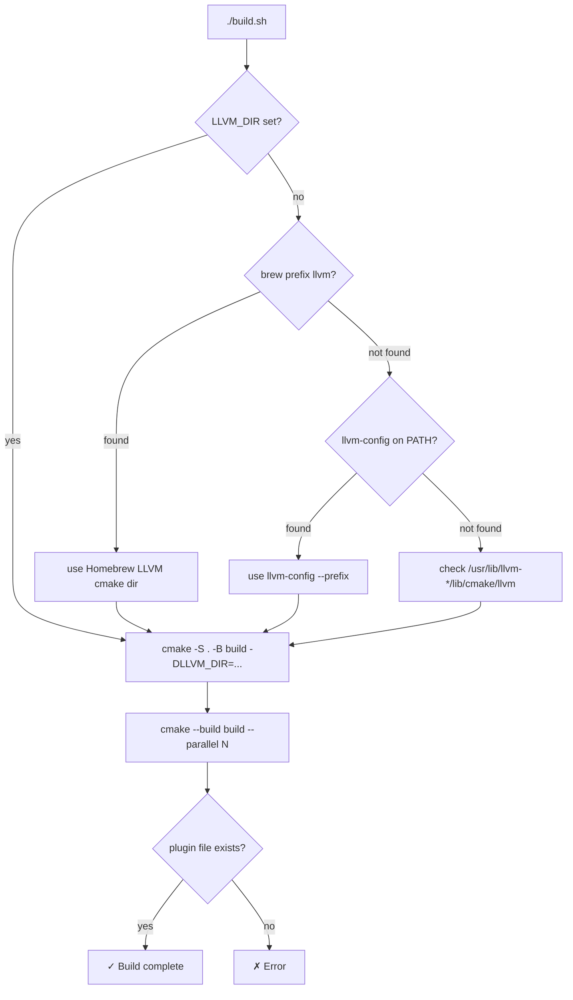
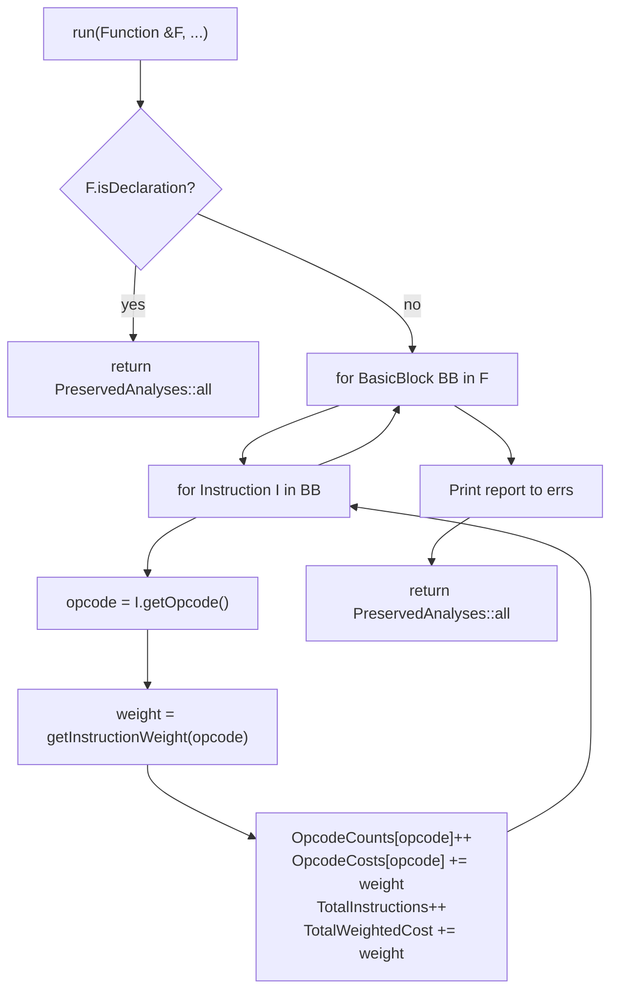

# IMPLEMENTATION — Weighted Instruction Frequency Analysis Pass

## 1. Repository Structure

```text
WeightedInstrFreq/
├── build.sh                      # Configure + build via CMake
├── run.sh                        # Load plugin and run opt on test files
├── CMakeLists.txt                # CMake build definition
├── src/
│   ├── WeightedInstrFreq.cpp     # Pass class + plugin registration (main)
│   ├── WeightedInstrFreq.h       # Pass declaration header
│   └── PassPlugin.cpp            # Standalone plugin registration example
├── tests/
│   ├── test1.ll  … test7.ll     # LLVM IR test cases (≥5 required)
│   └── test4.c                   # C source used to generate test4.ll
├── output/
│   └── test*_output.txt          # Reference outputs (captured from opt)
└── documentation/
    ├── DESIGN.md                 # This file's companion: approach + alternatives
    ├── IMPLEMENTATION.md         # You are here
    └── EVALUATION.md             # Metrics, baselines, test-case table
```

---

## 2. Build System

### CMakeLists.txt highlights

```cmake
find_package(LLVM REQUIRED CONFIG)          # Locate LLVM CMake package
add_library(WeightedInstrFreqPass SHARED    # Shared library = loadable plugin
    src/WeightedInstrFreq.cpp)
llvm_map_components_to_libnames(llvm_libs
    Core Support Passes)                    # Only what the pass needs
target_link_libraries(WeightedInstrFreqPass ${llvm_libs})
set_target_properties(WeightedInstrFreqPass PROPERTIES
    PREFIX ""                               # Suppress "lib" prefix on macOS
    OUTPUT_NAME "WeightedInstrFreqPass")
```

The plugin is a **shared library** (`.dylib` / `.so`) loaded at runtime by `opt`. No static linking into any host binary is required.

### build.sh logic



---

## 3. Pass Implementation (`src/WeightedInstrFreq.cpp`)

### 3.1 Data structures

```cpp
// Weight table: LLVM opcode ID → cost integer
std::map<unsigned, unsigned> InstructionWeights = {
    {Instruction::Add,   1},  {Instruction::Mul,  2},
    {Instruction::Load,  3},  {Instruction::Store, 3},
    {Instruction::Call,  5},  {Instruction::AtomicRMW, 10},
    // ... (full table in src/WeightedInstrFreq.cpp)
};

// Per-run accumulators (local to WeightedInstrFreqPass::run)
std::map<unsigned, unsigned> OpcodeCounts;   // opcode → count
std::map<unsigned, unsigned> OpcodeCosts;    // opcode → accumulated cost
unsigned TotalInstructions = 0;
unsigned TotalWeightedCost = 0;
```

### 3.2 IR traversal



### 3.3 Most-expensive instruction detection

```cpp
unsigned MaxCost = 0, MaxOpcode = 0;
for (auto &Entry : OpcodeCosts) {
    if (Entry.second > MaxCost) {
        MaxCost    = Entry.second;
        MaxOpcode  = Entry.first;
    }
}
errs() << "Most Expensive Instruction Type: "
       << getOpcodeName(MaxOpcode)
       << " (cost: " << MaxCost << ")\n";
```

Ties are broken by map iteration order (opcode ID ascending), which is deterministic for a given LLVM version.

### 3.4 Output formatting

The pass uses `llvm::errs()` (LLVM's `raw_ostream` alias for `stderr`) for output. `llvm::format()` provides `printf`-style column alignment:

```cpp
errs() << format("%-20s %10u %10u\n", name, count, cost);
```

---

## 4. Plugin Registration

```cpp
extern "C" LLVM_ATTRIBUTE_WEAK ::llvm::PassPluginLibraryInfo
llvmGetPassPluginInfo() {
    return {
        LLVM_PLUGIN_API_VERSION,
        "WeightedInstrFreqPass",
        LLVM_VERSION_STRING,
        [](PassBuilder &PB) {
            // Registration point 1: explicit name in pass pipeline string
            PB.registerPipelineParsingCallback(
                [](StringRef Name, FunctionPassManager &FPM, ...) {
                    if (Name == "weighted-instr-freq") {
                        FPM.addPass(WeightedInstrFreqPass());
                        return true;
                    }
                    return false;
                });

            // Registration point 2: auto-run at O2/O3
            PB.registerOptimizerLastEPCallback(
                [](ModulePassManager &MPM, OptimizationLevel Level, ...) {
                    if (Level == O2 || Level == O3) {
                        FunctionPassManager FPM;
                        FPM.addPass(WeightedInstrFreqPass());
                        MPM.addPass(createModuleToFunctionPassAdaptor(std::move(FPM)));
                    }
                });
        }
    };
}
```

The `LLVM_ATTRIBUTE_WEAK` attribute allows the host tool (`opt`) to find the symbol without hard-linking against the plugin's symbols.

---

## 5. LLVM API Surface Used

| LLVM API | Header | Purpose |
|----------|--------|---------|
| `PassInfoMixin<T>` | `llvm/IR/PassManager.h` | Base class for new-PM passes |
| `Function::isDeclaration()` | `llvm/IR/Function.h` | Skip external symbols |
| `Function::getName()` | `llvm/IR/Function.h` | Report function name |
| `BasicBlock` range iteration | `llvm/IR/BasicBlock.h` | Walk all BBs |
| `Instruction::getOpcode()` | `llvm/IR/Instruction.h` | Get LLVM opcode enum value |
| `Instruction::*` opcode constants | `llvm/IR/Instruction.h` | Weight table keys |
| `PassBuilder` | `llvm/Passes/PassBuilder.h` | Register pipeline callbacks |
| `llvmGetPassPluginInfo` / `PassPluginLibraryInfo` | `llvm/Plugins/PassPlugin.h` | Plugin entry point |
| `errs()` | `llvm/Support/raw_ostream.h` | Thread-safe stderr output |
| `format()` | `llvm/Support/Format.h` | Column-aligned text output |

---

## 6. Running the Pass

### Explicit pass name
```bash
opt -load-pass-plugin ./build/WeightedInstrFreqPass.dylib \
    -passes='function(weighted-instr-freq)' \
    -disable-output tests/test1.ll
```

### Via optimisation pipeline (O2)
```bash
opt -load-pass-plugin ./build/WeightedInstrFreqPass.dylib \
    -O2 -disable-output tests/test4.ll
```

### Compile C → IR → run pass
```bash
clang -O0 -emit-llvm -S -o /tmp/prog.ll tests/test4.c
opt -load-pass-plugin ./build/WeightedInstrFreqPass.dylib \
    -passes='function(weighted-instr-freq)' \
    -disable-output /tmp/prog.ll
```

---

## 7. Compile-time Compatibility Notes

* Requires **LLVM 14+** for the new pass manager plugin API (`llvm/Plugins/PassPlugin.h`).
* Tested on **LLVM 22.x** (Homebrew on macOS).
* The `registerOptimizerLastEPCallback` signature changed in LLVM 17 to include `ThinOrFullLTOPhase` — handled in `src/WeightedInstrFreq.cpp`.
* The plugin is built as a **position-independent shared library** (CMake default for `SHARED` targets).
